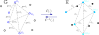
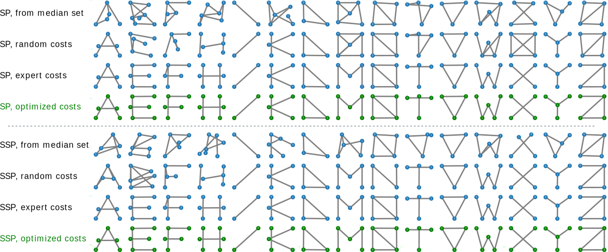

# ged-cost-learning

The `ged-cost-learn-framework` project is the code for the paper [Bridging Distinct Spaces in Graph-based Machine Learning](whatwhat?).

## How to use?

### Install the prerequisite libraries:

```
python3 -m pip install graphkit-learn
python3 -m pip install seaborn
# The followings are required to run the GNN models:
python3 -m pip install torch torchvision torchaudio --index-url https://download.pytorch.org/whl/cu118
python3 -m pip install torch-geometric pyg_lib torch_scatter torch_sparse torch_cluster torch_spline_conv -f https://data.pyg.org/whl/torch-2.0.0+cu118.html
```

NVIDIA GPU and driver is required to run the GNN models. 
Check [this tutorial](https://pytorch-geometric.readthedocs.io/en/latest/notes/installation.html) for more information.

### Install the library

```
git clone git@github.com:jajupmochi/ged-cost-learn-framework.git
cd ged-cost-learning/
python setup.py develop [--user]
```

### Run the code

```
python3 gcl_frame/models/run_xps.py
```

The outputs are in the `gcl_frame/models/outputs/` directory.

### The illustration of align two spaces

Align GEDs in graph space G and distances in an embedding space E:



## Results gallery

### On prediction problems

Results on each dataset in terms of RMSE for regression and accuracy (in %) for classification, measured on the test sets. The "-" notation indicate that the method is not suitable for the dataset:

### On the pre-image problem

Pre-images constructed by different algorithms for Letter-high with shortest path (SP) and structural shortest path (SSP) kernels:



## Authors

* [Linlin Jia](https://jajupmochi.github.io/), the PRG group, Institute of Computer Science, University of Bern
* [Xiao Ning](https://xiao-nx.github.io/), State Key Laboratory of Bioelectronics, School of Biological Science and Medical Engineering, Southeast University
* [Benoit Gaüzère](https://bgauzere.github.io/), the LITIS Lab, INSA Rouen Normandie
* [Paul Honeine](https://honeine.fr/wp/), the LITIS Lab, Université de Rouen Normandie
* [Kaspar Riesen](https://prg.inf.unibe.ch/index.php/people/kaspar-riesen/), the PRG group, Institute of Computer Science, University of Bern

## Citation

If you have used this library in your publication, please cite the following paper (Coming soon):

```

```

## Acknowledgments

This research was supported by Swiss National Science Foundation (SNSF) Project No. 200021_188496. The authors would like to thank the COBRA lab (Chimie Organique Bioorganique: Réactivité et Analyse) and the ITODYS lab (Le laboratoire Interfaces Traitements Organisation et
DYnamique des Systèmes) for providing the Redox dataset.
