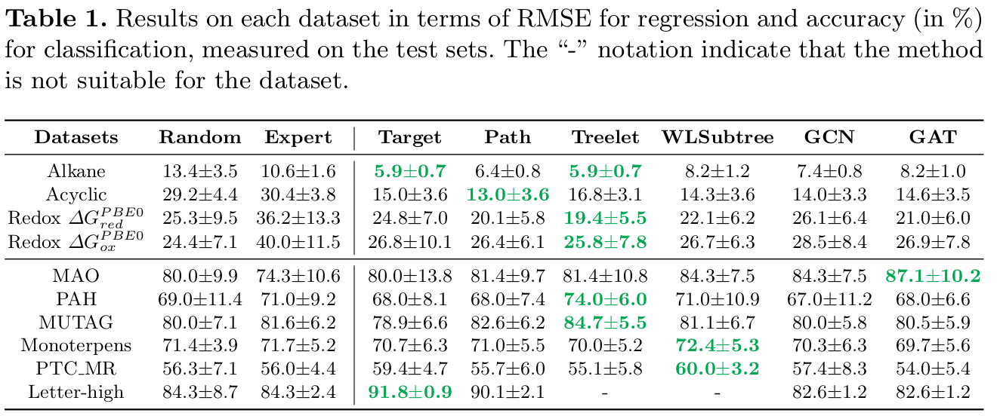

# ged-cost-learn-framework
[](https://doi.org/10.1007/978-3-031-47637-2_1)
[](https://ericlab.org/acpr2023/)
[](https://normandie-univ.hal.science/LITIS/hal-04194644v2)

[](http://makeapullrequest.com)

[](https://github.com/jajupmochi/ged-cost-learning/archive/master.zip) 
[](https://twitter.com/intent/follow?screen_name=jajupmochi) 

The `ged-cost-learn-framework` project is the code for the paper 
[Bridging Distinct Spaces in Graph-based Machine Learning](https://doi.org/10.1007/978-3-031-47637-2_1) ([preprint](https://www.researchgate.net/publication/374199943_Bridging_Distinct_Spaces_in_Graph-based_Machine_Learning)) published in the proceedings of [ACPR 2023](https://ericlab.org/acpr2023/).

## How to use?

### Install the prerequisite libraries:

```
python3 -m pip install graphkit-learn
python3 -m pip install seaborn
# The followings are required to run the GNN models:
python3 -m pip install torch torchvision torchaudio --index-url https://download.pytorch.org/whl/cu118
python3 -m pip install torch-geometric pyg_lib torch_scatter torch_sparse torch_cluster torch_spline_conv -f https://data.pyg.org/whl/torch-2.0.0+cu118.html
```

NVIDIA GPU and driver is required to run the GNN models. 
Check [this tutorial](https://zhuanlan.zhihu.com/p/634250809) for more information.

### Install the library

```
git clone git@github.com:jajupmochi/ged-cost-learn-framework.git
cd ged-cost-learning/
python setup.py [develop] [--user]
```

### Run the code

```
python3 gcl_frame/models/run_xps.py
```

The outputs will be in the `gcl_frame/models/outputs/` directory.

## Model illustrations

### The GECL framework


### Alignment of two spaces

Align GEDs in graph space G and distances in an embedding space E:


## Results gallery

### On prediction problems

Results on each dataset in terms of RMSE for regression and accuracy (in %) for classification, measured on the test sets. The "-" notation indicate that the method is not suitable for the dataset:



### On the pre-image problem

Pre-images constructed by different algorithms for Letter-high with shortest path (SP) and structural shortest path (SSP) kernels:


## Authors

* [Linlin Jia](https://jajupmochi.github.io/), the PRG group, Institute of Computer Science, University of Bern
* [Xiao Ning](https://xiao-nx.github.io/), State Key Laboratory of Bioelectronics, School of Biological Science and Medical Engineering, Southeast University
* [Benoit Gaüzère](https://bgauzere.github.io/), the LITIS Lab, INSA Rouen Normandie
* [Paul Honeine](https://honeine.fr/wp/), the LITIS Lab, Université de Rouen Normandie
* [Kaspar Riesen](https://prg.inf.unibe.ch/index.php/people/kaspar-riesen/), the PRG group, Institute of Computer Science, University of Bern

## Citation

If you have used this library in your publication, please cite the following paper:

```
@inproceedings{jia2023bridging,
  title={Bridging Distinct Spaces in Graph-Based Machine Learning},
  author={Jia, Linlin and Ning, Xiao and Ga{\"u}z{\`e}re, Benoit and Honeine, Paul and Riesen, Kaspar},
  booktitle={Asian Conference on Pattern Recognition},
  pages={1--14},
  year={2023},
  organization={Springer}
}
```

## Acknowledgments

This research was supported by Swiss National Science Foundation (SNSF) Project 
No. 200021_188496. The authors would like to thank [the COBRA lab](https://www.lab-cobra.fr/cobra/) 
(Chimie Organique Bioorganique: Réactivité et Analyse) and 
[the ITODYS lab](https://www.itodys.univ-paris-diderot.fr/fr/) 
(Le laboratoire Interfaces Traitements Organisation et
DYnamique des Systèmes) for providing the Redox dataset.
